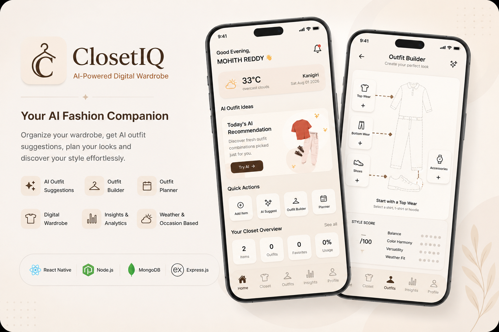
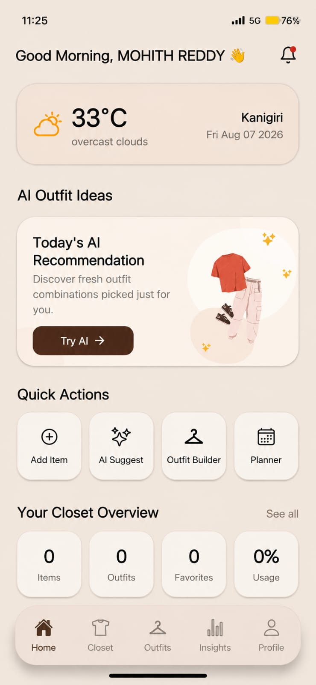
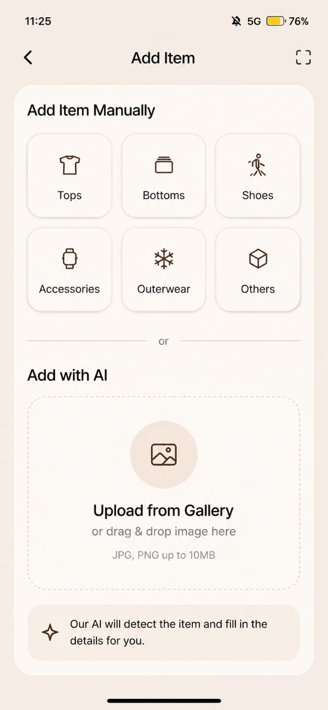
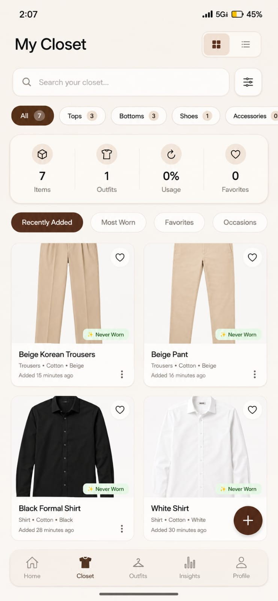
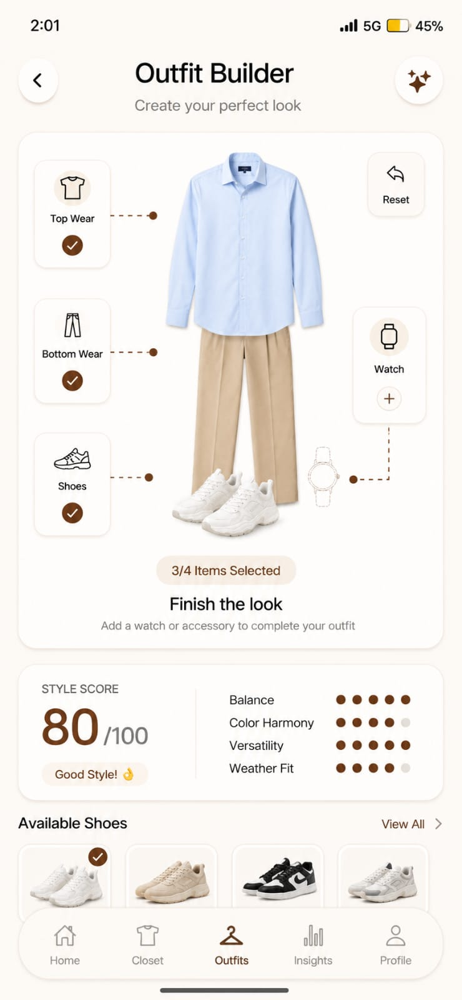
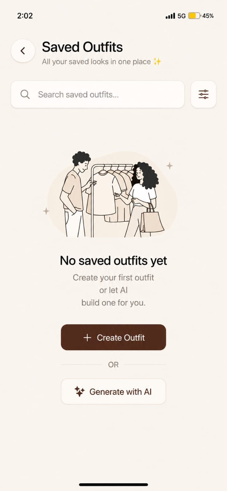
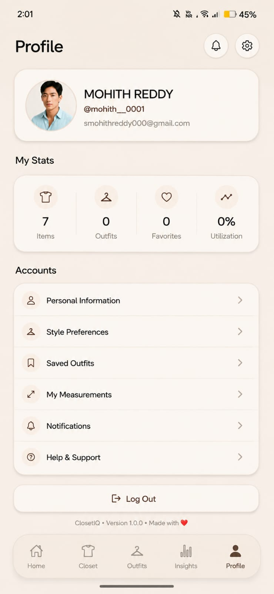

<h1 align="center">ClosetIQ – AI Powered Smart Wardrobe Assistant </h1>
<p align="center">
  
</p>


<p align="center">
  <strong>Digitize your wardrobe. Create better outfits. Dress smarter with AI.</strong>
  <br><br>
  Organize your wardrobe • Build outfits • Get personalized AI recommendations • Plan your style effortlessly.
</p>

---

<!-- ===================== Key Features ===================== -->

<h3 align="center">✨ Key Features</h3>

<p align="center">
  👔 Digital Closet &nbsp;&nbsp;•&nbsp;&nbsp;
  🤖 AI Recommendations &nbsp;&nbsp;•&nbsp;&nbsp;
  🎨 Outfit Builder &nbsp;&nbsp;•&nbsp;&nbsp;
  📅 Outfit Planner &nbsp;&nbsp;•&nbsp;&nbsp;
  ☁️ Cloud Storage
</p>

---

<!-- ===================== Built With ===================== -->

<h3 align="center">🛠️ Built With</h3>

<p align="center">
  
  
  
  
  
  
</p>

------

## 📑 Table of Contents

- 🚀 [Overview](#overview)
- ✨ [Features](#features)
- 🛠️ [Tech Stack](#tech-stack)
- 🏗️ [Architecture](#architecture)
  - 🧠 [Recommendation Engine](#recommendation-engine)
  - 📂 [Project Structure](#project-structure)
- 📸 [Screenshots](#screenshots)
- 🌐 [REST API](#api-endpoints)
  - 🗄️ [Database Overview](#database)
- ⚙️ [Installation](#installation)
  - 🔐 [Environment Variables](#environment-variables)
- 🚀 [Deployment](#deployment)
- 🗺️ [Future Work](#future-work)
- 🤝 [Contributing](#contributing)
- 📄 [License](#license)
- 👨‍💻 [Author](#author)

---
<a id="overview"></a>
# 🚀 Overview

ClosetIQ is a full-stack AI-powered wardrobe management application built with React Native, Node.js, Express.js, and MongoDB. It helps users digitize their wardrobe, organize clothing items, create custom outfits, and plan their daily style from a single mobile application.

At its core, ClosetIQ features a custom recommendation engine that analyzes wardrobe contents, personal preferences, colors, materials, occasions, seasons, and style compatibility to generate intelligent outfit suggestions. The application also includes secure authentication, cloud-based image storage, wardrobe analytics, and an intuitive outfit planner, providing a personalized and seamless fashion experience.

<a id="features"></a>
# ✨ Features

> 👔 **Digital Closet** — Organize and categorize your wardrobe with rich clothing metadata.

> 🤖 **AI Outfit Recommendations** — Get personalized outfit suggestions based on your wardrobe.

> 🎨 **Interactive Outfit Builder** — Create, preview, and save custom outfit combinations from your wardrobe.

> 📅 **Smart Outfit Planner** — Plan outfits for upcoming events using an integrated calendar.

> ☁️ **Cloud Image Management** — Store and retrieve clothing images securely with Cloudinary.

> 🔐 **Secure Authentication** — Firebase Authentication with protected REST APIs.

> 📊 **Wardrobe Analytics** — Visualize wardrobe insights and clothing statistics.

> 👤 **Personalized Experience** — Tailored recommendations powered by your profile and style preferences.

> 📱 **Cross-Platform** — Built with React Native (Expo) for Android and iOS.

<a id="tech-stack"></a>
# 🛠 Tech Stack

| Category | Technologies |
|----------|--------------|
| 📱 **Frontend** | React Native (Expo) • React Navigation • Context API • Axios • React Native Reanimated |
| ⚙️ **Backend** | Node.js • Express.js |
| 🗄️ **Database** | MongoDB • Mongoose |
| 🔐 **Authentication** | Firebase Authentication • JWT |
| ☁️ **Cloud Storage** | Cloudinary |

<a id="architecture"></a>
# 🏗️ Architecture

```text
                    ┌─────────────────────┐
                    │   React Native App  │
                    │       (Expo)        │
                    └──────────┬──────────┘
                               │
                         REST API (Axios)
                               │
                    ┌──────────▼──────────┐
                    │    Express Server   │
                    ├─────────────────────┤
                    │ Authentication      │
                    │ Closet Management   │
                    │ Outfit Management   │
                    │ Outfit Planner      │
                    │ AI Recommendations  │
                    └───────┬───────┬─────┘
                            │       │
                 ┌──────────▼──┐ ┌──▼───────────┐
                 │  MongoDB    │ │  Cloudinary  │
                 │  Database   │ │ Image Storage│
                 └─────────────┘ └──────────────┘
```
<a id="recommendation-engine"></a>
# 🧠 Recommendation Engine

```text
                    ┌─────────────────┐
                    │    Wardrobe     │
                    │     Items       │
                    └────────┬────────┘
                             │
                    ┌────────▼────────┐
                    │ Candidate       │
                    │ Generation      │
                    └────────┬────────┘
                             │
              ┌──────────────▼──────────────┐
              │     Compatibility Scoring   │
              ├─────────────────────────────┤
              │ Color • Material • Style    │
              │ Occasion • Season           │
              └──────────────┬──────────────┘
                             │
                    ┌────────▼────────┐
                    │ Personalization │
                    ├─────────────────┤
                    │ Favorite Colors │
                    │ Preferred Style │
                    │ Preferred Fit   │
                    └────────┬────────┘
                             │
                    ┌────────▼────────┐
                    │ Outfit Ranking  │
                    └────────┬────────┘
                             │
                    ┌────────▼────────┐
                    │  Explanation    │
                    │    Generator    │
                    └────────┬────────┘
                             │
                    ┌────────▼────────┐
                    │ Recommendations │
                    └─────────────────┘
```

<a id="project-structure"></a>
# 📂 Project Structure

```text
ClosetIQ/
│
├── Client/
│   ├── assets/
│   │   ├── outfitBuilder/
│   │   └── *.png / *.jpeg / *.avif
│   │
│   ├── src/
│   │   ├── components/
│   │   │   ├── closet/
│   │   │   ├── common/
│   │   │   ├── home/
│   │   │   ├── onboarding/
│   │   │   ├── outfitBuilder/
│   │   │   ├── outfits/
│   │   │   ├── planner/
│   │   │   └── profile/
│   │   │
│   │   ├── config/
│   │   ├── constants/
│   │   ├── context/
│   │   ├── hooks/
│   │   ├── navigation/
│   │   ├── screens/
│   │   │   ├── auth/
│   │   │   ├── closet/
│   │   │   ├── home/
│   │   │   ├── insights/
│   │   │   ├── onboarding/
│   │   │   ├── outfits/
│   │   │   ├── planner/
│   │   │   └── profile/
│   │   │
│   │   ├── services/
│   │   ├── styles/
│   │   ├── theme/
│   │   └── utils/
│   │
│   ├── App.js
│   ├── app.json
│   ├── firebase.js
│   ├── index.js
│   ├── eas.json
│   └── package.json
│
├── Server/
│   ├── config/
│   │   ├── cloudinary.js
│   │   ├── db.js
│   │   └── firebase.js
│   │
│   ├── controllers/
│   │   ├── authController.js
│   │   ├── itemController.js
│   │   ├── outfitController.js
│   │   ├── plannerController.js
│   │   ├── recommendationController.js
│   │   └── userController.js
│   │
│   ├── middleware/
│   │   ├── authMiddleware.js
│   │   ├── errorMiddleware.js
│   │   ├── uploadMiddleware.js
│   │   └── validate.js
│   │
│   ├── models/
│   │   ├── Item.js
│   │   ├── Outfit.js
│   │   ├── Planner.js
│   │   └── User.js
│   │
│   ├── routes/
│   │   ├── auth.js
│   │   ├── items.js
│   │   ├── outfits.js
│   │   ├── planner.js
│   │   ├── recommendation.js
│   │   └── users.js
│   │
│   ├── services/
│   │   ├── ai/
│   │   ├── image/
│   │   └── recommendationEngine/
│   │       ├── cache/
│   │       ├── config/
│   │       ├── engine/
│   │       ├── explain/
│   │       ├── generator/
│   │       ├── knowledge/
│   │       ├── models/
│   │       ├── scoring/
│   │       └── utils/
│   │
│   ├── shared/
│   ├── utils/
│   ├── server.js
│   └── package.json
│
└── screenshots/
    ├── banner.png
    ├── home.jpeg
    ├── add.jpeg
    ├── closet.jpeg
    ├── outfit-builder.jpeg
    ├── saved-outfits.jpeg
    └── profile.jpeg
```

<a id="screenshots"></a>
# 📸 Screenshots

<p align="center">
  
  
  
</p>

<br>

<p align="center">
  
  
  
</p>

<a id="api-endpoints"></a>
# 🌐 REST API

| Module | Method | Endpoint | Description |
|--------|:------:|----------|-------------|
| 🔐 Authentication | POST | `/api/auth/signup` | Register a new user |
|  | POST | `/api/auth/login` | Authenticate user |
|  | POST | `/api/auth/google` | Google Sign-In |
| 👤 Users | GET | `/api/users/profile` | Retrieve user profile |
|  | PUT | `/api/users/profile` | Update user profile |
| 👔 Closet | GET | `/api/items` | Fetch all wardrobe items |
|  | POST | `/api/items` | Add a new clothing item |
|  | GET | `/api/items/:id` | Get a clothing item by ID |
|  | PUT | `/api/items/:id` | Update a clothing item |
|  | DELETE | `/api/items/:id` | Remove a clothing item |
| 🎨 Outfits | GET | `/api/outfits` | Fetch saved outfits |
|  | POST | `/api/outfits` | Save a new outfit |
|  | GET | `/api/outfits/:id` | Get outfit details |
|  | PUT | `/api/outfits/:id` | Update an outfit |
|  | DELETE | `/api/outfits/:id` | Delete an outfit |
| 📅 Planner | GET | `/api/planner` | Retrieve planned outfits |
|  | POST | `/api/planner` | Create a new plan |
|  | GET | `/api/planner/:id` | Get planner details |
|  | PUT | `/api/planner/:id` | Update a planner entry |
|  | DELETE | `/api/planner/:id` | Delete a planner entry |
| 🤖 AI Recommendations | POST | `/api/recommendation` | Generate AI outfit recommendations |

<a id="database"></a>
# 🗄️ Database Overview

ClosetIQ uses **MongoDB** with **Mongoose** to store user information, wardrobe items, outfits, and outfit plans. The database is designed to maintain efficient relationships between collections while supporting personalized recommendations and planning features.

| Collection | Description |
|------------|-------------|
| 👤 **User** | Stores user profile, preferences, measurements, and authentication details. |
| 👕 **Item** | Stores wardrobe items, clothing metadata, images, colors, materials, seasons, and occasions. |
| 🎨 **Outfit** | Stores user-created and AI-generated outfit combinations. |
| 📅 **Planner** | Stores scheduled outfits, dates, and planner notes. |

### Relationships

- 👤 **One User** → **Many Items**
- 👤 **One User** → **Many Outfits**
- 👤 **One User** → **Many Planner Entries**
- 👕 **Many Items** → **One Outfit**
- 🎨 **One Outfit** → **Many Planner Entries**

<a id="installation"></a>
# ⚙️ Installation

### 1. Clone the Repository

```bash
git clone https://github.com/yourusername/ClosetIQ.git
cd ClosetIQ
```

### 2. Install Client Dependencies

```bash
cd Client
npm install
```

Start the Expo development server:

```bash
npx expo start
```

### 3. Install Server Dependencies

Open a new terminal:

```bash
cd Server
npm install
```

Start the backend server:

```bash
npm run dev
```

---

<a id="environment-variables"></a>
# 🔐 Environment Variables

Create a `.env` file inside the `Server` directory and add the required environment variables:

```env
PORT=
MONGO_URI=

JWT_SECRET=

CLOUDINARY_CLOUD_NAME=
CLOUDINARY_API_KEY=
CLOUDINARY_API_SECRET=

FIREBASE_PROJECT_ID=
FIREBASE_CLIENT_EMAIL=
FIREBASE_PRIVATE_KEY=

GEMINI_API_KEY=
```

> **Note:** Never commit your `.env` file or Firebase service account credentials to the repository.

---

<!-- <a id="demo"></a>
# 🎥 Demo

Experience ClosetIQ in action:

<p align="center">
  <a href="https://youtu.be/YOUR_VIDEO_ID">
    
  </a>
</p>

--- -->

<a id="deployment"></a>
# 🚀 Deployment

ClosetIQ can be deployed using **Expo EAS**, **Render/Railway**, **MongoDB Atlas**, and **Cloudinary**.

### 📱 Mobile App — Expo EAS

Install the EAS CLI:

```bash
npm install -g eas-cli
```

Login to your Expo account:

```bash
eas login
```

Build the Android application:

```bash
cd Client
eas build --platform android
```

For a preview APK:

```bash
eas build --platform android --profile preview
```

For a production build:

```bash
eas build --platform android --profile production
```

### ⚙️ Backend — Render / Railway

Install dependencies:

```bash
cd Server
npm install
```

Start the production server:

```bash
npm start
```

Configure the required environment variables on your deployment platform before starting the server.

### 🗄️ Database — MongoDB Atlas

Configure the MongoDB Atlas connection string:

```env
MONGO_URI=your_mongodb_connection_string
```

### ☁️ Image Storage — Cloudinary

Configure your Cloudinary credentials:

```env
CLOUDINARY_CLOUD_NAME=
CLOUDINARY_API_KEY=
CLOUDINARY_API_SECRET=
```

---

<a id="future-work"></a>
# 🔮 Future Work

The following improvements are planned for future versions of ClosetIQ:

* 🌦️ **Weather-Aware Recommendations** — Suggest outfits based on current weather conditions.
* 🧺 **Laundry Tracking** — Track clothing usage and laundry status.
* 👔 **Capsule Wardrobe** — Generate optimized capsule wardrobes from existing items.
* 👗 **Fashion Trends** — Incorporate current fashion trends into recommendations.
* 🛍️ **Smart Shopping** — Recommend clothing based on wardrobe gaps and personal preferences.
* 👥 **Social Sharing** — Allow users to share outfits and styling ideas with others.

---

<a id="contributing"></a>
# 🤝 Contributing

Contributions are welcome and appreciated!

### 1. Fork the Repository

Fork the ClosetIQ repository to your GitHub account.

### 2. Clone Your Fork

```bash
git clone https://github.com/yourusername/ClosetIQ.git
cd ClosetIQ
```

### 3. Create a Feature Branch

```bash
git checkout -b feature/your-feature-name
```

### 4. Make Your Changes

Implement your feature or fix and test it locally.

### 5. Commit Your Changes

```bash
git add .
git commit -m "Add: your feature description"
```

### 6. Push Your Branch

```bash
git push origin feature/your-feature-name
```

### 7. Open a Pull Request

Create a Pull Request from your feature branch to the `main` branch and describe the changes you've made.

---

<a id="license"></a>
# 📄 License
ClosetIQ is licensed under the **MIT License** 
see the[`LICENSE`](LICENSE) file for more information.
---

<a id="author"></a>
# 👨‍💻 Author

### Mohith Reddy

**Full Stack Developer • React Native Developer • B.Tech CSE (2026)**

Passionate about building modern full-stack and mobile applications with **React Native, Node.js, Express.js, MongoDB, and AI-powered technologies**.

<p align="left">
  <a href="https://github.com/Mohith-Creator">
    
  </a>
</p>

<p align="center">
  <strong>⭐ If you like ClosetIQ, consider giving the repository a star!</strong>
</p>
